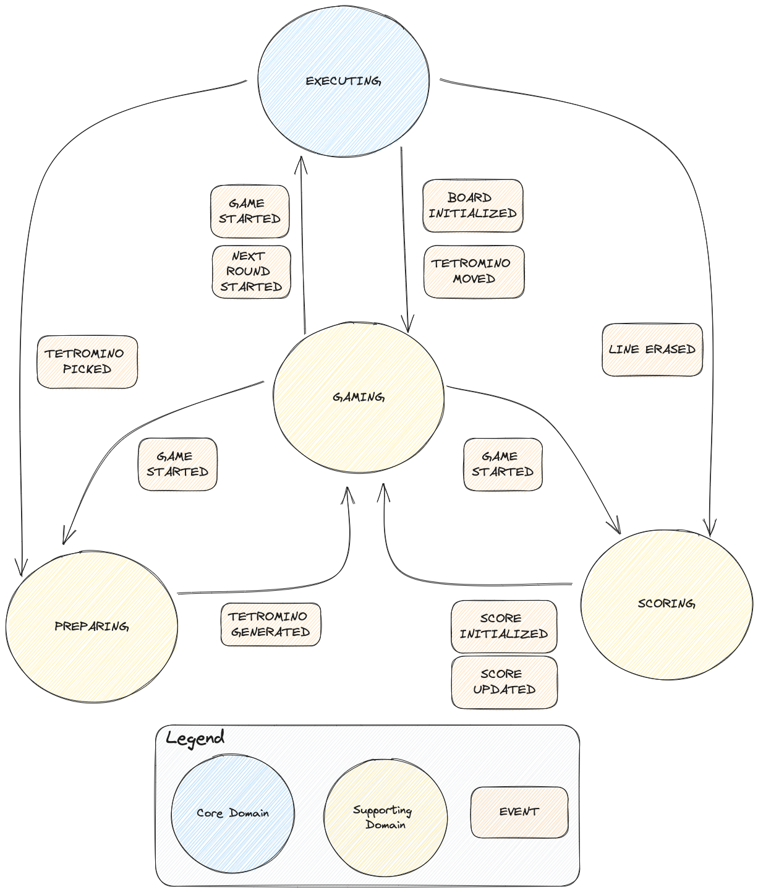

# Goal

Use strategical then tactical DDD patterns to create the Tetris game.

# Bounded contexts
## Executing

Core domain responsible for the board aggregate which contains all tetrominos.

## Gaming

Supporting domain responsible for the game lyfecycle.

## Preparing

Supporting domain responsible for the next round in our case generating the next tetromino.

## Scoring

Supporting domain responsible for computing the tetris score.

### Note

It's interesting to notice that tetromino model is different between the bounded contexts.
The executing context will need positions but not the preparing context which needs only the shape.
The shared model is explicitly put in the shared directory.

# Flow Modeling Diagram

## Launch Tetris

I use javafx framework for the UI. The UI is built to react with all the domain events.
To start the game just execute:

mvn clean javafx:run

